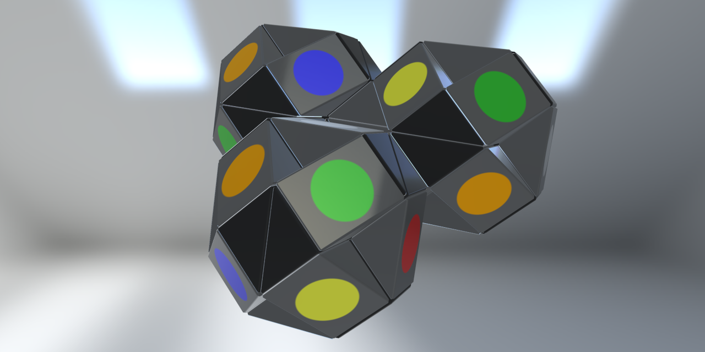

# Magic Snake

## Description
Are you up for the twistable challenge? The Magic Snake (also Rubik's Snake, Rubik's Twist) is a twisting puzzle challenge that sharpens your thinking about shapes and spaces. By being twisted, the Magic Snake can be conformed to mimic a wide variety of objects, animals, or geometric shapes.

The goal is to match a shape by rotating prism wedges. Each prism can be rotated by 90 degrees clockwise or counter-clockwise per turn. Solve one shape and move onto another of many simple to complex shapes. It is a difficult puzzle, which offers you hours of mind-stimulating entertainment. And just in case it has you stumped, each shape comes with an assembly demonstration to help you master the challenge.

You can also devise your own creations in free play mode and share them to defy your friends.

Erno Rubik, inventor of the Rubik's Snake and the most popular Rubik's Cube, said that "The snake is not a problem to be solved; it offers infinite possibilities of combination. It is a tool to test out ideas of shape in space."

## Run
[Open on GitHub Pages](https://iliagrigorevdev.github.io/magicsnake/)
